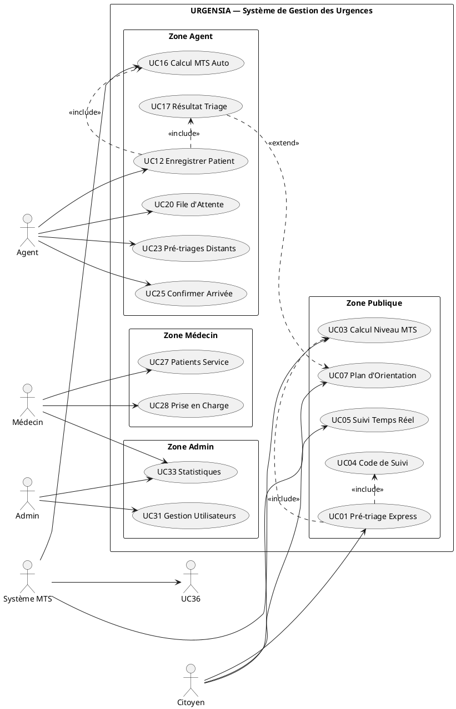

# 🏥 URGENSIA — Documentation Complète

> **Système Intelligent de Gestion des Urgences Hospitalières**
> Mémoire de soutenance — Documentation technique et fonctionnelle complète

---

## 📋 Table des matières

1. [Présentation du projet](#1-présentation-du-projet)
2. [Architecture technique](#2-architecture-technique)
3. [Stack technologique](#3-stack-technologique)
4. [Structure des dossiers](#4-structure-des-dossiers)
5. [Fonctionnalités détaillées](#5-fonctionnalités-détaillées)
6. [Modèle Logique des Données (MLD)](#6-modèle-logique-des-données-mld)
7. [API REST — Endpoints](#7-api-rest--endpoints)
8. [Diagramme de cas d'utilisation (UCDs)](#8-diagramme-de-cas-dutilisation)
9. [Diagramme de classes](#9-diagramme-de-classes)
10. [Diagrammes de séquence](#10-diagrammes-de-séquence)
11. [Diagrammes d'activité](#11-diagrammes-dactivité)
12. [Installation et démarrage](#12-installation-et-démarrage)
13. [Comptes de démonstration](#13-comptes-de-démonstration)
14. [Flux WebSocket (temps réel)](#14-flux-websocket-temps-réel)
15. [Moteur de triage Manchester](#15-moteur-de-triage-manchester)
16. [Sécurité](#16-sécurité)

---

## 1. Présentation du projet

### 1.1 Contexte et problématique

Les services d'urgences hospitalières dans les pays en développement font face à une triple crise :
- **Surcharge** : afflux de patients sans priorisation efficace
- **Désorganisation** : absence de système de triage numérique
- **Manque de communication** : patients ignorants leur position dans la file

**URGENSIA** est une application web full-stack développée pour digitaliser, automatiser et optimiser la gestion des urgences hospitalières, en s'appuyant sur le **Système de Triage de Manchester (MTS)** — standard international de classification des urgences en 5 niveaux de priorité.

### 1.2 Objectifs du système

| Objectif | Description |
|----------|-------------|
| **Triage automatisé** | Calculer automatiquement le niveau de priorité MTS d'un patient selon ses symptômes et constantes vitales |
| **Pré-triage citoyen** | Permettre au patient de s'auto-évaluer depuis chez lui avant de se rendre aux urgences |
| **Suivi temps réel** | Afficher en temps réel la position du patient dans la file d'attente |
| **Orientation interactive** | Guider visuellement le patient vers son service via un plan interactif |
| **Tableaux de bord** | Fournir des vues adaptées à chaque rôle (agent, médecin, admin) |
| **Notifications push** | Alerter le personnel soignant en cas de cas critique |

### 1.3 Acteurs du système

| Acteur | Rôle |
|--------|------|
| **Citoyen / Patient** | Accès public : pré-triage, suivi file, plan d'accès |
| **Agent d'accueil** | Enregistrement patients, confirmation arrivée, gestion file |
| **Médecin** | Consultation dossiers, prise en charge, statistiques |
| **Administrateur** | Gestion utilisateurs, services, rapports globaux |

---

## 2. Architecture technique

```
┌─────────────────────────────────────────────────────────────────────┐
│                         CLIENT (Navigateur)                          │
│                    React 18 + Vite + TailwindCSS                    │
│   ┌──────────┐  ┌──────────┐  ┌──────────┐  ┌───────────────────┐  │
│   │  Agent   │  │ Médecin  │  │  Admin   │  │ Citoyen (Public)  │  │
│   │Dashboard │  │Dashboard │  │Dashboard │  │ PreTriage + Suivi │  │
│   └──────────┘  └──────────┘  └──────────┘  └───────────────────┘  │
└───────────────────────────┬──────────────┬──────────────────────────┘
                            │ HTTP/REST    │ WebSocket (Socket.io)
                            ▼              ▼
┌─────────────────────────────────────────────────────────────────────┐
│                         SERVEUR NODE.JS                              │
│                      Express.js + Socket.io                         │
│                                                                     │
│  ┌──────────┐ ┌──────────┐ ┌──────────┐ ┌───────────┐ ┌─────────┐ │
│  │  Auth    │ │ Patients │ │ Triage   │ │PreTriage  │ │Orientat.│ │
│  │ (JWT)    │ │ Routes   │ │ Service  │ │ Routes    │ │ Routes  │ │
│  └──────────┘ └──────────┘ └──────────┘ └───────────┘ └─────────┘ │
│                                                                     │
│  ┌──────────┐ ┌──────────┐ ┌──────────┐ ┌───────────┐             │
│  │Services  │ │  Notifs  │ │  Stats   │ │  Audit    │             │
│  │ Routes   │ │ Routes   │ │ Routes   │ │ Middleware│             │
│  └──────────┘ └──────────┘ └──────────┘ └───────────┘             │
└───────────────────────────┬─────────────────────────────────────────┘
                            │ SQL (node-postgres)
                            ▼
┌─────────────────────────────────────────────────────────────────────┐
│                        PostgreSQL 14+                               │
│   services │ utilisateurs │ patients │ pre_triages                  │
│   niveaux_manchester │ symptomes │ patient_symptomes               │
│   triages │ notifications │ sessions │ journal_audit               │
│   localisation_services                                             │
└─────────────────────────────────────────────────────────────────────┘
```

### 2.1 Pattern architectural

- **Backend** : Architecture **MVC** (Model-View-Controller) avec séparation claire Routes → Controllers → Services → Database
- **Frontend** : Architecture **Component-Based** React avec Context API pour l'état global
- **Temps réel** : Modèle **Pub/Sub** via Socket.io avec rooms isolées par code de pré-triage
- **Authentification** : **JWT (Access Token 1h + Refresh Token 7j)** stockés en mémoire / httpOnly cookie

---

## 3. Stack technologique

### Frontend
| Technologie | Version | Usage |
|------------|---------|-------|
| React | 18.x | Framework UI |
| Vite | 5.x | Build tool / Dev server |
| TailwindCSS | 3.x | Styling utilitaire |
| Framer Motion | 11.x | Animations |
| Socket.io-client | 4.x | WebSocket client |
| React Router DOM | 6.x | Routage SPA |
| Axios | 1.x | Appels HTTP |
| Lucide React | Latest | Icônes SVG |
| qrcode.react | Latest | Génération QR Code |
| React Hook Form | 7.x | Gestion formulaires |

### Backend
| Technologie | Version | Usage |
|------------|---------|-------|
| Node.js | 18+ | Runtime |
| Express.js | 4.x | Framework HTTP |
| Socket.io | 4.x | WebSocket server |
| pg (node-postgres) | 8.x | Client PostgreSQL |
| jsonwebtoken | 9.x | Génération/vérification JWT |
| bcryptjs | 2.x | Hachage mots de passe |
| multer | 1.x | Upload de fichiers |
| pdfkit | 0.x | Génération PDF |
| helmet | 7.x | Sécurité HTTP headers |
| cors | 2.x | Cross-Origin Resource Sharing |
| express-rate-limit | 7.x | Protection bruteforce |
| morgan | 1.x | Logs HTTP |
| nodemon | 3.x | Dev hot-reload |

### Base de données
| Technologie | Usage |
|------------|-------|
| PostgreSQL 14+ | SGBD principal |
| pgcrypto | Génération UUID |
| JSONB | Stockage score triage + chemin SVG |

---

## 4. Structure des dossiers

```
URGENSIA/
├── urgensia-api/                     # Backend Node.js
│   ├── src/
│   │   ├── app.js                    # Point d'entrée, config Express + Socket.io
│   │   ├── config/
│   │   │   ├── env.js                # Variables d'environnement centralisées
│   │   │   └── db.js                 # Pool de connexions PostgreSQL
│   │   ├── routes/
│   │   │   ├── auth.routes.js        # /api/auth
│   │   │   ├── patients.routes.js    # /api/patients
│   │   │   ├── services.routes.js    # /api/services
│   │   │   ├── utilisateurs.routes.js# /api/utilisateurs
│   │   │   ├── notifications.routes.js# /api/notifications
│   │   │   ├── stats.routes.js       # /api/stats
│   │   │   ├── pretriage.routes.js   # /api/pretriage
│   │   │   └── orientation.routes.js # /api/orientation
│   │   ├── controllers/
│   │   │   ├── auth.controller.js
│   │   │   ├── patients.controller.js
│   │   │   ├── services.controller.js
│   │   │   ├── utilisateurs.controller.js
│   │   │   ├── notifications.controller.js
│   │   │   ├── stats.controller.js
│   │   │   ├── pretriage.controller.js
│   │   │   └── orientation.controller.js
│   │   ├── services/
│   │   │   ├── triage.service.js     # Moteur MTS (algorithme)
│   │   │   ├── socket.service.js     # Gestionnaire Socket.io
│   │   │   └── notif.service.js      # Service notifications
│   │   ├── middleware/
│   │   │   ├── auth.js               # Vérification JWT
│   │   │   ├── roles.js              # Contrôle d'accès par rôle
│   │   │   ├── audit.js              # Journal d'audit automatique
│   │   │   └── errorHandler.js       # Gestion centralisée des erreurs
│   │   └── db/
│   │       ├── migrations/
│   │       │   ├── 001_init.sql      # Schéma initial (11 tables)
│   │       │   ├── 002_pretriage.sql # Table pre_triages
│   │       │   ├── 003_orientation.sql# Table localisation_services
│   │       │   ├── 004_code_suivi_patient.sql # Code de suivi patient
│   │       │   └── 005_retriage.sql  # Re-triage : historique + réévaluation
│   │       └── seeds/
│   │           └── 001_seed.sql      # Données initiales + comptes démo
│   ├── uploads/                      # Photos patients uploadées
│   └── .env                          # Variables d'environnement
│
└── urgensia/                         # Frontend React
    ├── src/
    │   ├── App.jsx                   # Routeur principal
    │   ├── main.jsx                  # Point d'entrée React
    │   ├── index.css                 # Styles globaux + design system
    │   ├── context/
    │   │   ├── AppContext.jsx         # État global (patients, triage en cours)
    │   │   └── AuthContext.jsx        # État auth (user, token, login/logout)
    │   ├── components/
    │   │   ├── common/               # Composants réutilisables (Button, Card, Avatar…)
    │   │   ├── layout/               # DashboardLayout, Header, Sidebar
    │   │   └── orientation/          # HospitalMap.jsx, QRCodeDisplay.jsx
    │   ├── pages/
    │   │   ├── landing/LandingPage.jsx
    │   │   ├── auth/LoginPage.jsx
    │   │   ├── agent/               # Dashboard, NewPatient, Queue, Patients, Triage…
    │   │   ├── doctor/DoctorDashboard.jsx
    │   │   ├── admin/AdminDashboard.jsx
    │   │   ├── citoyen/             # PreTriagePage.jsx, SuiviFilePage.jsx
    │   │   └── orientation/         # OrientationPage.jsx
    │   └── services/
    │       ├── api.js               # Instance Axios + intercepteurs JWT
    │       ├── authService.js
    │       ├── patientService.js
    │       ├── statsService.js
    │       ├── utilisateurService.js
    │       ├── preTriageService.js
    │       ├── socketService.js
    │       └── orientationService.js
    └── public/
```

---

## 5. Fonctionnalités détaillées

### 5.1 Authentification & Sécurité

- **Connexion** par email + mot de passe
- **JWT Access Token** (durée : 1h) transmis dans l'en-tête `Authorization: Bearer`
- **Refresh Token** (durée : 7 jours) stocké en base dans la table `sessions`
- **Rôles** : `agent`, `medecin`, `admin` avec contrôle d'accès middleware
- **Journal d'audit** : toute action sensible est tracée en base (IP, timestamp, résultat)
- **Rate limiting** : protection anti-bruteforce sur `/api/auth/connexion`
- Hachage des mots de passe avec **bcrypt** (cost factor 10)

### 5.2 Tableau de bord Agent

- **Enregistrement patient** : formulaire 4 étapes (identité → constantes vitales → symptômes → évaluation)
- **Calcul automatique MTS** : appel au moteur de triage backend
- **Résultat triage** : affichage couleur, niveau, service, recommandations, plan d'orientation
- **File d'attente** : liste priorisée temps réel, mise à jour WebSocket
- **Gestion patients** : liste complète, filtrage, statuts
- **Pré-triages à distance** : réception et confirmation d'arrivée des citoyens

### 5.3 Tableau de bord Médecin

- Vue des patients affectés au service
- Prise en charge / changement de statut
- Consultation des dossiers médicaux
- Statistiques de service

### 5.4 Tableau de bord Admin

- Gestion des utilisateurs (CRUD complet)
- Gestion des services hospitaliers
- Statistiques globales : patients/jour, temps moyen, répartition MTS
- Rapports exportables

### 5.5 Pré-triage Express Citoyen (PUBLIC — sans compte)

**Flux en 3 étapes :**

**Étape 1 — Identité** (optionnelle)
- Prénom, Nom, Âge, Sexe, Téléphone
- Possibilité de continuer anonymement

**Étape 2 — Symptômes**
- 6 symptômes critiques (douleur thoracique, hémorragie, convulsions, etc.)
- 6 symptômes modérés (fièvre, vomissements, malaise, etc.)
- Échelle de douleur EVA (0-10)
- Température optionnelle

**Étape 3 — Résultat**
- Niveau MTS calculé (N1 à N5) avec couleur
- Code de suivi unique (`URG-XXXX`) valable 24h
- Délai estimé de prise en charge
- Service d'orientation recommandé
- Bouton "Suivi temps réel"
- Bouton "Plan d'accès à l'hôpital"

### 5.6 Suivi Temps Réel (PUBLIC)

- Connexion WebSocket via code de suivi (`/suivi/:code`)
- Affichage en temps réel :
  - Niveau Manchester + badge coloré
  - Statut actuel (en_attente → arrivé → en_cours → terminé)
  - Nombre de patients devant
  - Estimation du temps d'attente en minutes
  - Visualisation graphique de la file
- Fallback polling HTTP toutes les 60 secondes si WebSocket indisponible
- Alerte si urgence vitale (N1/N2)

### 5.7 Orientation Assistée + Plan Interactif (PUBLIC + PROTÉGÉ)

**Accessible depuis :**
- TriageResultPage (bouton agent, couleur MTS)
- PreTriagePage (étape 3, bouton citoyen)
- SuiviFilePage (bouton de navigation)
- QR Code (depuis le téléphone du patient)

**Contenu de la page :**
- **Carte patient** : photo/avatar, nom, numéro de dossier, niveau MTS
- **Plan SVG interactif** : 8 services (Accueil, Urgences, Réanimation, Cardiologie, Médecine Générale, Pédiatrie, Radiologie, Laboratoire)
  - Service destination surligné automatiquement avec couleur MTS
  - Chemin animé depuis l'accueil (animation de tracé)
  - Marqueur 📍 pulsant sur la destination
  - Tooltip au survol de chaque salle
- **Localisation** : Bâtiment, étage, salle, instructions textuelles
- **Itinéraire en 3 étapes** numérotées
- **QR Code** : lien vers la page d'orientation (copier, partager, télécharger SVG)
- **Numéros d'urgence** : SAMU (15), Pompiers (18)

### 5.8 Notifications Push (Temps Réel)

- Notification automatique à tous les agents/médecins lors d'un **cas critique (N1)**
- Notification lors de la **soumission d'un pré-triage** citoyen
- Badge de count dans la barre de navigation
- Marquage lu / non lu en base de données

---

## 6. Modèle Logique des Données (MLD)

### 6.1 Tables et attributs

```
SERVICES (
  id              UUID [PK]
  nom             VARCHAR(100) [UNIQUE, NOT NULL]
  description     TEXT
  medecin_chef    VARCHAR(150)
  capacite_lits   INT [>0, NOT NULL, DEFAULT 10]
  lits_occupes    INT [>=0, NOT NULL, DEFAULT 0]
  actif           BOOLEAN [DEFAULT TRUE]
  date_creation   TIMESTAMPTZ [DEFAULT NOW()]
  CONTRAINTE: lits_occupes <= capacite_lits
)

UTILISATEURS (
  id                  UUID [PK]
  nom                 VARCHAR(100) [NOT NULL]
  prenom              VARCHAR(100) [NOT NULL]
  email               VARCHAR(255) [UNIQUE, NOT NULL, FORMAT EMAIL]
  mot_de_passe_hash   VARCHAR(255) [NOT NULL]
  role                VARCHAR(20) [IN ('agent','medecin','admin')]
  service_id          UUID [FK → SERVICES.id, ON DELETE SET NULL]
  telephone           VARCHAR(20)
  photo_url           TEXT
  statut              VARCHAR(20) [IN ('actif','inactif','suspendu')]
  date_creation       TIMESTAMPTZ [DEFAULT NOW()]
  derniere_connexion  TIMESTAMPTZ
)

SESSIONS (
  id              UUID [PK]
  utilisateur_id  UUID [FK → UTILISATEURS.id, ON DELETE CASCADE]
  refresh_token   TEXT [UNIQUE, NOT NULL]
  adresse_ip      VARCHAR(45)
  user_agent      TEXT
  expire_le       TIMESTAMPTZ [NOT NULL]
  cree_le         TIMESTAMPTZ [DEFAULT NOW()]
  revoque         BOOLEAN [DEFAULT FALSE]
)

NIVEAUX_MANCHESTER (
  niveau          INT [PK, BETWEEN 1 AND 5]
  label           VARCHAR(50) [NOT NULL]
  couleur_hex     VARCHAR(7) [NOT NULL]
  bg_couleur_hex  VARCHAR(7) [NOT NULL]
  delai_max       VARCHAR(30) [NOT NULL]
  description     TEXT
)

PATIENTS (
  id                      UUID [PK]
  nom                     VARCHAR(100) [NOT NULL]
  prenom                  VARCHAR(100) [NOT NULL]
  age                     INT [NOT NULL, 0-150]
  sexe                    VARCHAR(10) [IN ('Homme','Femme','Autre')]
  telephone               VARCHAR(20)
  adresse                 TEXT
  photo_url               TEXT
  temperature             NUMERIC(4,1) [30-45]
  tension_systolique      INT [50-300]
  tension_diastolique     INT [30-200]
  frequence_cardiaque     INT [20-300]
  saturation_oxygene      INT [50-100]
  echelle_douleur         INT [NOT NULL, DEFAULT 0, 0-10]
  manchester_niveau       INT [FK → NIVEAUX_MANCHESTER.niveau]
  service_id              UUID [FK → SERVICES.id, ON DELETE SET NULL]
  statut                  VARCHAR(20) [IN ('en_attente','en_cours','pris_en_charge','sorti')]
  resume_clinique         TEXT
  enregistre_par          UUID [FK → UTILISATEURS.id]
  pris_en_charge_par      UUID [FK → UTILISATEURS.id]
  date_arrivee            TIMESTAMPTZ [DEFAULT NOW()]
  date_prise_en_charge    TIMESTAMPTZ
  date_sortie             TIMESTAMPTZ
)

SYMPTOMES (
  id              UUID [PK]
  label           VARCHAR(100) [UNIQUE, NOT NULL]
  est_critique    BOOLEAN [DEFAULT FALSE]
  icone           VARCHAR(50)
)

PATIENT_SYMPTOMES (
  patient_id      UUID [PK, FK → PATIENTS.id, ON DELETE CASCADE]
  symptome_id     UUID [PK, FK → SYMPTOMES.id, ON DELETE CASCADE]
  date_ajout      TIMESTAMPTZ [DEFAULT NOW()]
)

TRIAGES (
  id                  UUID [PK]
  patient_id          UUID [UNIQUE, FK → PATIENTS.id, ON DELETE CASCADE]
  realise_par         UUID [FK → UTILISATEURS.id]
  manchester_niveau   INT [FK → NIVEAUX_MANCHESTER.niveau]
  service_oriente     VARCHAR(100)
  justification       TEXT
  score_calcule       JSONB
  date_triage         TIMESTAMPTZ [DEFAULT NOW()]
)

NOTIFICATIONS (
  id              UUID [PK]
  destinataire_id UUID [FK → UTILISATEURS.id, ON DELETE CASCADE]
  patient_id      UUID [FK → PATIENTS.id, ON DELETE SET NULL]
  type            VARCHAR(20) [IN ('critical','warning','info','success')]
  message         TEXT [NOT NULL]
  est_lue         BOOLEAN [DEFAULT FALSE]
  date_creation   TIMESTAMPTZ [DEFAULT NOW()]
)

JOURNAL_AUDIT (
  id              UUID [PK]
  utilisateur_id  UUID [FK → UTILISATEURS.id, ON DELETE SET NULL]
  action          VARCHAR(100) [NOT NULL]
  adresse_ip      VARCHAR(45)
  statut          VARCHAR(10) [IN ('succes','echec')]
  details_json    JSONB
  timestamp       TIMESTAMPTZ [DEFAULT NOW()]
)

PRE_TRIAGES (
  id                  UUID [PK]
  code_suivi          VARCHAR(20) [UNIQUE, NOT NULL]  -- ex: URG-4X7K
  prenom              VARCHAR(100)
  nom                 VARCHAR(100)
  age                 INT
  sexe                VARCHAR(10)
  telephone           VARCHAR(20)
  -- Symptômes (flags booléens MTS)
  douleur_thoracique  BOOLEAN [DEFAULT FALSE]
  difficulte_respi    BOOLEAN [DEFAULT FALSE]
  hemorragie          BOOLEAN [DEFAULT FALSE]
  perte_conscience    BOOLEAN [DEFAULT FALSE]
  convulsions         BOOLEAN [DEFAULT FALSE]
  traumatisme         BOOLEAN [DEFAULT FALSE]
  fievre              BOOLEAN [DEFAULT FALSE]
  vomissements        BOOLEAN [DEFAULT FALSE]
  malaise             BOOLEAN [DEFAULT FALSE]
  brulures            BOOLEAN [DEFAULT FALSE]
  cephalees           BOOLEAN [DEFAULT FALSE]
  diarrhee            BOOLEAN [DEFAULT FALSE]
  echelle_douleur     INT [0-10, DEFAULT 0]
  temperature         NUMERIC(4,1)
  -- Résultat triage
  manchester_niveau   INT [FK → NIVEAUX_MANCHESTER.niveau]
  service_oriente     VARCHAR(100)
  resume_clinique     TEXT
  -- Suivi
  statut              VARCHAR(20) [IN ('en_attente','arrive','en_cours','termine','expire')]
  position_file       INT
  patients_devant     INT
  estimation_minutes  INT
  -- Horodatages
  date_creation       TIMESTAMPTZ [DEFAULT NOW()]
  expire_le           TIMESTAMPTZ [DEFAULT NOW() + 24h]
  date_arrivee        TIMESTAMPTZ
)

LOCALISATION_SERVICES (
  id                      UUID [PK]
  service_nom             VARCHAR(100) [UNIQUE, NOT NULL]
  batiment                VARCHAR(100) [NOT NULL]
  etage                   VARCHAR(50) [NOT NULL]
  salle                   VARCHAR(50)
  description_chemin      TEXT
  plan_x                  FLOAT [NOT NULL]     -- Coordonnée X dans SVG viewBox 780x480
  plan_y                  FLOAT [NOT NULL]     -- Coordonnée Y dans SVG viewBox 780x480
  chemin_depuis_accueil   JSONB [NOT NULL]     -- [{x,y}, {x,y}, ...] waypoints
  couleur_plan            VARCHAR(7) [DEFAULT '#0F766E']
  icone_emoji             VARCHAR(10)
  date_mise_a_jour        TIMESTAMPTZ [DEFAULT NOW()]
)
```

### 6.2 Relations (clés étrangères)

```
UTILISATEURS.service_id          → SERVICES.id
SESSIONS.utilisateur_id          → UTILISATEURS.id
PATIENTS.manchester_niveau       → NIVEAUX_MANCHESTER.niveau
PATIENTS.service_id              → SERVICES.id
PATIENTS.enregistre_par          → UTILISATEURS.id
PATIENTS.pris_en_charge_par      → UTILISATEURS.id
PATIENT_SYMPTOMES.patient_id     → PATIENTS.id
PATIENT_SYMPTOMES.symptome_id    → SYMPTOMES.id
TRIAGES.patient_id               → PATIENTS.id (1-1)
TRIAGES.realise_par              → UTILISATEURS.id
TRIAGES.manchester_niveau        → NIVEAUX_MANCHESTER.niveau
NOTIFICATIONS.destinataire_id    → UTILISATEURS.id
NOTIFICATIONS.patient_id         → PATIENTS.id
JOURNAL_AUDIT.utilisateur_id     → UTILISATEURS.id
PRE_TRIAGES.manchester_niveau    → NIVEAUX_MANCHESTER.niveau
```

### 6.3 MLD Textuel (notation relationnelle)

```
services (#id, nom, description, medecin_chef, capacite_lits, lits_occupes, actif, date_creation)

utilisateurs (#id, nom, prenom, email, mot_de_passe_hash, role, service_id*→services, telephone, photo_url, statut, date_creation, derniere_connexion)

sessions (#id, utilisateur_id*→utilisateurs, refresh_token, adresse_ip, user_agent, expire_le, cree_le, revoque)

niveaux_manchester (#niveau, label, couleur_hex, bg_couleur_hex, delai_max, description)

patients (#id, nom, prenom, age, sexe, telephone, adresse, photo_url, temperature, tension_systolique, tension_diastolique, frequence_cardiaque, saturation_oxygene, echelle_douleur, manchester_niveau*→niveaux_manchester, service_id*→services, statut, resume_clinique, enregistre_par*→utilisateurs, pris_en_charge_par*→utilisateurs, date_arrivee, date_prise_en_charge, date_sortie)

symptomes (#id, label, est_critique, icone)

patient_symptomes (#patient_id*→patients, #symptome_id*→symptomes, date_ajout)

triages (#id, patient_id*→patients, realise_par*→utilisateurs, manchester_niveau*→niveaux_manchester, service_oriente, justification, score_calcule, date_triage)

notifications (#id, destinataire_id*→utilisateurs, patient_id*→patients, type, message, est_lue, date_creation)

journal_audit (#id, utilisateur_id*→utilisateurs, action, adresse_ip, statut, details_json, timestamp)

pre_triages (#id, code_suivi[UNIQUE], prenom, nom, age, sexe, telephone, [symptômes_booléens × 12], echelle_douleur, temperature, manchester_niveau*→niveaux_manchester, service_oriente, resume_clinique, statut, position_file, patients_devant, estimation_minutes, date_creation, expire_le, date_arrivee)

localisation_services (#id, service_nom[UNIQUE], batiment, etage, salle, description_chemin, plan_x, plan_y, chemin_depuis_accueil, couleur_plan, icone_emoji, date_mise_a_jour)
```

---

## 7. API REST — Endpoints

### Auth — `/api/auth`
| Méthode | Endpoint | Auth | Description |
|---------|----------|------|-------------|
| POST | `/connexion` | ❌ | Connexion, retourne JWT + refresh token |
| POST | `/deconnexion` | ✅ | Révocation du refresh token |
| POST | `/refresh` | ❌ | Renouvellement du JWT via refresh token |
| GET | `/moi` | ✅ | Profil de l'utilisateur connecté |

### Patients — `/api/patients`
| Méthode | Endpoint | Auth | Description |
|---------|----------|------|-------------|
| GET | `/` | ✅ | Liste de tous les patients (file d'attente) |
| POST | `/` | ✅ Agent | Créer patient + calculer triage MTS |
| POST | `/urgence` | ✅ Agent | Cas critique : enregistrement rapide (niveau 1 forcé) |
| POST | `/reevaluation/scan` | ✅ Agent/Admin | Détecter les délais de réévaluation dépassés (tâche planifiée / chargement file) |
| GET | `/:id` | ✅ | Détail d'un patient (triage courant) |
| GET | `/:id/triages` | ✅ | Historique des triages (initial + re-triages) |
| POST | `/:id/triage` | ✅ Agent | **Re-triage** : réévaluation MTS, historique conservé, file réordonnée |
| PATCH | `/:id/statut` | ✅ | Changer le statut du patient |
| DELETE | `/:id` | ✅ Admin | Supprimer un patient |
| POST | `/:id/photo` | ✅ | Upload photo patient (multipart) |
| GET | `/:id/pdf` | ✅ | Générer PDF du dossier médical |

### Services — `/api/services`
| Méthode | Endpoint | Auth | Description |
|---------|----------|------|-------------|
| GET | `/` | ✅ | Liste des services hospitaliers |
| POST | `/` | ✅ Admin | Créer un service |
| PATCH | `/:id` | ✅ Admin | Modifier un service |
| DELETE | `/:id` | ✅ Admin | Désactiver un service |

### Utilisateurs — `/api/utilisateurs`
| Méthode | Endpoint | Auth | Description |
|---------|----------|------|-------------|
| GET | `/` | ✅ Admin | Liste des utilisateurs |
| POST | `/` | ✅ Admin | Créer un utilisateur |
| PATCH | `/:id` | ✅ | Modifier un utilisateur |
| DELETE | `/:id` | ✅ Admin | Suspendre un utilisateur |

### Notifications — `/api/notifications`
| Méthode | Endpoint | Auth | Description |
|---------|----------|------|-------------|
| GET | `/` | ✅ | Notifications de l'utilisateur |
| PATCH | `/:id/lue` | ✅ | Marquer une notification comme lue |
| PATCH | `/tout-lire` | ✅ | Marquer toutes comme lues |

### Statistiques — `/api/stats`
| Méthode | Endpoint | Auth | Description |
|---------|----------|------|-------------|
| GET | `/` | ✅ | Dashboard stats (patients, niveaux, tendances) |

### Pré-triage — `/api/pretriage`
| Méthode | Endpoint | Auth | Description |
|---------|----------|------|-------------|
| POST | `/` | ❌ Public | Soumettre un pré-triage citoyen |
| GET | `/:code` | ❌ Public | Statut par code de suivi |
| PATCH | `/:code/confirmer` | ✅ Agent | Confirmer l'arrivée d'un citoyen |
| GET | `/liste/actifs` | ✅ Agent | Liste des pré-triages actifs |

### Orientation — `/api/orientation`
| Méthode | Endpoint | Auth | Description |
|---------|----------|------|-------------|
| GET | `/plan` | ❌ Public | Données SVG de tous les services |
| GET | `/pretriage/:code` | ❌ Public | Orientation d'un pré-triage citoyen |
| GET | `/patient/:patientId` | ✅ | Orientation d'un patient enregistré |

---

## 8. Diagramme de cas d'utilisation

> **Instructions pour génération UML :**
> Utilise PlantUML ou Mermaid. Le diagramme principal est `URGENSIA_UseCases`.

```
ACTEURS :
  - Citoyen (acteur principal public)
  - Agent d'accueil (acteur authentifié)
  - Médecin (acteur authentifié)
  - Administrateur (acteur authentifié)
  - Système (acteur secondaire — moteur MTS, Socket.io)

CAS D'UTILISATION PAR ACTEUR :

[Citoyen]
  UC01 - Effectuer un pré-triage express (sans compte)
    include → UC02 - Saisir ses symptômes
    include → UC03 - Obtenir son niveau Manchester estimé
    include → UC04 - Recevoir un code de suivi
  UC05 - Suivre sa position en file d'attente (temps réel)
    extend → UC06 - Voir les notifications de mise à jour
  UC07 - Consulter le plan d'orientation de l'hôpital
    include → UC08 - Voir le service de destination surligné
    include → UC09 - Obtenir les instructions d'itinéraire
    include → UC10 - Scanner/Partager le QR code

[Agent d'accueil]
  UC11 - Se connecter au système
  UC12 - Enregistrer un nouveau patient
    include → UC13 - Saisir les informations personnelles
    include → UC14 - Mesurer les constantes vitales
    include → UC15 - Sélectionner les symptômes
    include → UC16 - Déclencher le calcul MTS automatique
  UC17 - Consulter le résultat du triage
    include → UC18 - Voir le niveau Manchester + service
    extend → UC19 - Voir le plan d'orientation du patient
  UC20 - Gérer la file d'attente
    include → UC21 - Visualiser les patients priorisés
    include → UC22 - Changer le statut d'un patient
  UC23 - Gérer les pré-triages citoyens
    include → UC24 - Recevoir les notifications de pré-triage
    include → UC25 - Confirmer l'arrivée physique d'un citoyen
  UC26 - Consulter la liste des patients

[Médecin]
  UC11 - Se connecter au système
  UC27 - Consulter les patients de son service
  UC28 - Prendre en charge un patient
    include → UC29 - Mettre à jour le statut (en cours → sorti)
  UC30 - Consulter les statistiques de service

[Administrateur]
  UC11 - Se connecter au système
  UC31 - Gérer les utilisateurs (CRUD)
  UC32 - Gérer les services hospitaliers (CRUD)
  UC33 - Consulter les statistiques globales
  UC34 - Exporter des rapports

[Système]
  UC35 - Calculer le niveau MTS (algorithme Manchester)
  UC36 - Émettre des notifications WebSocket (temps réel)
  UC37 - Journaliser les actions (audit trail)
  UC38 - Générer le code de suivi unique (URG-XXXX)
```

### PlantUML — Diagramme simplifié



---

## 9. Diagramme de classes

> **Instructions :** Le diagramme de classes représente les entités métier du système avec leurs attributs et méthodes principales.

```
CLASSES MÉTIER :

┌────────────────────────────────┐
│          Utilisateur           │
├────────────────────────────────┤
│ - id : UUID                    │
│ - nom : String                 │
│ - prenom : String              │
│ - email : String               │
│ - motDePasseHash : String      │
│ - role : Role {agent,médecin,  │
│           admin}               │
│ - statut : Statut              │
│ - service : Service            │
│ - telephone : String           │
│ - photoUrl : String            │
│ - dateCreation : DateTime      │
│ - derniereConnexion : DateTime │
├────────────────────────────────┤
│ + seConnecter(email, mdp)      │
│ + seDeconnecter()              │
│ + mettreAJourProfil()          │
└────────────────────────────────┘
           |
           | 1..*
           ▼
┌────────────────────────────────┐
│             Service            │
├────────────────────────────────┤
│ - id : UUID                    │
│ - nom : String                 │
│ - description : String         │
│ - medecinChef : String         │
│ - capaciteLits : Int           │
│ - litsOccupes : Int            │
│ - actif : Boolean              │
├────────────────────────────────┤
│ + getTauxOccupation() : Float  │
│ + estDisponible() : Boolean    │
└────────────────────────────────┘
           |
           | 0..*
           ▼
┌────────────────────────────────┐
│            Patient             │
├────────────────────────────────┤
│ - id : UUID                    │
│ - nom : String                 │
│ - prenom : String              │
│ - age : Int                    │
│ - sexe : String                │
│ - temperature : Float          │
│ - tensionSystolique : Int      │
│ - tensionDiastolique : Int     │
│ - frequenceCardiaque : Int     │
│ - saturationOxygene : Int      │
│ - echelleDouleur : Int(0-10)   │
│ - manchesterNiveau : Int(1-5)  │
│ - statut : StatutPatient       │
│ - resumeClinique : String      │
│ - dateArrivee : DateTime       │
├────────────────────────────────┤
│ + enregistrer(payload)         │
│ + changerStatut(nouveau)       │
│ + genererPDF() : Buffer        │
└────────────────────────────────┘
           |
    ┌──────┴───────┐
    │              │
    ▼              ▼
┌──────────┐  ┌────────────────────────┐
│ Symptome │  │        Triage          │
├──────────┤  ├────────────────────────┤
│- id      │  │ - id : UUID            │
│- label   │  │ - patient : Patient    │
│- estCrit.│  │ - realisePar: Utilisat.│
│- icone   │  │ - manchesterNiveau: Int│
└──────────┘  │ - serviceOriente: Str  │
              │ - justification : Text │
              │ - scoreCalcule : JSON  │
              │ - dateTriage : DateTime│
              ├────────────────────────┤
              │ + calculerMTS()        │
              └────────────────────────┘

┌────────────────────────────────┐
│         NiveauManchester       │
├────────────────────────────────┤
│ - niveau : Int (1..5)          │
│ - label : String               │
│ - couleurHex : String          │
│ - delaiMax : String            │
│ - description : String         │
├────────────────────────────────┤
│ + getDelaiEnMinutes() : Int    │
│ + estCritique() : Boolean      │
└────────────────────────────────┘

┌────────────────────────────────┐
│           PreTriage            │
├────────────────────────────────┤
│ - id : UUID                    │
│ - codeSuivi : String [UNIQUE]  │
│ - prenom, nom, age, sexe       │
│ - symptomes : {[key]: Boolean} │
│ - echelleDouleur : Int         │
│ - temperature : Float          │
│ - manchesterNiveau : Int       │
│ - serviceOriente : String      │
│ - statut : StatutPreTriage     │
│ - positionFile : Int           │
│ - estimationMinutes : Int      │
│ - expireLe : DateTime          │
├────────────────────────────────┤
│ + genererCode() : String       │
│ + calculerMTS() : Int          │
│ + confirmerArrivee()           │
│ + getStatut() : StatutPreTriage│
└────────────────────────────────┘

┌────────────────────────────────┐
│       LocalisationService      │
├────────────────────────────────┤
│ - id : UUID                    │
│ - serviceNom : String          │
│ - batiment : String            │
│ - etage : String               │
│ - salle : String               │
│ - descriptionChemin : Text     │
│ - planX : Float                │
│ - planY : Float                │
│ - cheminDepuisAccueil : JSON[] │
│ - couleurPlan : String         │
├────────────────────────────────┤
│ + matchService(nom) : Loc.     │
│ + getWaypoints() : Point[]     │
└────────────────────────────────┘

┌────────────────────────────────┐
│         Notification           │
├────────────────────────────────┤
│ - id : UUID                    │
│ - destinataire : Utilisateur   │
│ - patient : Patient            │
│ - type : TypeNotif             │
│ - message : String             │
│ - estLue : Boolean             │
│ - dateCreation : DateTime      │
├────────────────────────────────┤
│ + marquerLue()                 │
│ + envoyer() : void             │
└────────────────────────────────┘

┌────────────────────────────────┐
│       MoteurTriageManchester   │
├────────────────────────────────┤
│ (Service Singleton)            │
├────────────────────────────────┤
│ + calculerNiveau(symptomes,    │
│     constantes) : Int          │
│ + determinerService(niveau)    │
│     : String                   │
│ + genererResume(payload)       │
│     : String                   │
│ + genererRecommandations(niv.) │
│     : String[]                 │
└────────────────────────────────┘

RELATIONS :
- Utilisateur (1) ----< (0..*) Notification
- Utilisateur (1) ----< (0..*) Patient [enregistre_par]
- Utilisateur (0..*) >---- (1) Service
- Patient (1) ----< (0..*) Symptome [via patient_symptomes]
- Patient (1) ---- (1) Triage [One-to-One]
- Patient (1) ----  NiveauManchester (FK)
- Triage (*)  ----  NiveauManchester (FK)
- PreTriage   ----  NiveauManchester (FK)
- LocalisationService ---- (lookup) Service [par nom]
```

---

## 10. Diagrammes de séquence

### 10.1 Séquence : Connexion Utilisateur

```
Acteurs : Agent, Frontend, Backend API, PostgreSQL, Socket.io

Agent         Frontend          Backend            PostgreSQL
  |               |                |                    |
  |-- Saisit email + mdp           |                    |
  |               |                |                    |
  |               |-- POST /api/auth/connexion          |
  |               |                |                    |
  |               |                |-- SELECT utilisateur WHERE email=?
  |               |                |                    |
  |               |                |<-- utilisateur{hash}
  |               |                |                    |
  |               |                |-- bcrypt.compare(mdp, hash)
  |               |                |                    |
  |               |          [mdp invalide]              |
  |               |<-- 401 Unauthorized                 |
  |               |                |                    |
  |               |          [mdp valide]               |
  |               |                |-- JWT.sign(payload, secret, 1h)
  |               |                |-- INSERT session (refreshToken, 7j)
  |               |                |                    |
  |               |<-- 200 {accessToken, refreshToken, user}
  |               |                |                    |
  |  Stocke token |                |                    |
  |  Redirige ----|                |                    |
  |  Dashboard    |                |                    |
```

### 10.2 Séquence : Enregistrement Patient + Triage MTS

```
Acteurs : Agent, Frontend, Backend API, MoteurMTS, PostgreSQL, Socket.io

Agent     Frontend          API              MoteurMTS     PostgreSQL  Socket.io
  |           |               |                  |              |           |
  |-- Étape1: Identité patient|                  |              |           |
  |-- Étape2: Constantes      |                  |              |           |
  |-- Étape3: Symptômes       |                  |              |           |
  |-- Clic "Évaluer"          |                  |              |           |
  |           |               |                  |              |           |
  |           |-- POST /api/patients {payload}   |              |           |
  |           |               |                  |              |           |
  |           |               |-- auth.verify(JWT)|             |           |
  |           |               |                  |              |           |
  |           |               |-- calculerNiveauManchester(     |           |
  |           |               |     symptomes, constantes)      |           |
  |           |               |                  |              |           |
  |           |               |         -- Score pondéré        |           |
  |           |               |         -- Niveau 1-5           |           |
  |           |               |         -- Service orienté      |           |
  |           |               |         -- Résumé clinique      |           |
  |           |               |<-- {niveau, service, résumé, recs}          |
  |           |               |                  |              |           |
  |           |               |-- INSERT patients(...)          |           |
  |           |               |-- INSERT triages(...)           |           |
  |           |               |-- INSERT patient_symptomes(...)  |           |
  |           |               |                  |<-- patients.id           |
  |           |               |                  |              |           |
  |           |         [niveau <= 2 CRITIQUE]                  |           |
  |           |               |-- notifService.notifierCritique()|          |
  |           |               |                  |   INSERT notifications   |
  |           |               |-- socket.emit("critical:patient", data)     |
  |           |               |                  |              | emit tous  |
  |           |               |                  |              | agents     |
  |           |<-- 201 {patient, triage}         |              |           |
  |           |               |                  |              |           |
  |-- Affiche TriageResultPage|                  |              |           |
  |-- Bouton "Plan Orientation"|                 |              |           |
```

### 10.3 Séquence : Pré-triage Citoyen Complet

```
Acteurs : Citoyen, Frontend(Public), Backend API, MoteurMTS, PostgreSQL, Socket.io, Agent

Citoyen    Frontend       API             MTS        PostgreSQL  Socket  Agent
   |           |             |              |              |        |       |
   |-- Ouvre /triage-citoyen |              |              |        |       |
   |-- Étape1: Identité opt. |              |              |        |       |
   |-- Étape2: Symptômes     |              |              |        |       |
   |-- Clic "Calculer"       |              |              |        |       |
   |           |             |              |              |        |       |
   |           |-- POST /api/pretriage      |              |        |       |
   |           |             |              |              |        |       |
   |           |             |-- calculerNiveauManchester(symptomes)        |
   |           |             |<-- {niveau, service, résumé}|        |       |
   |           |             |              |              |        |       |
   |           |             |-- genererCodeSuivi() → "URG-4X7K"   |       |
   |           |             |-- INSERT pre_triages(code, données, expire+24h)
   |           |             |              |              |        |       |
   |           |             |-- socket.emit("pretriage:new", data) |       |
   |           |             |              |              |   Notif        |
   |           |             |              |              |    →    | ← Alerte
   |           |<-- 201 {codeSuivi, niveau, service, ...}  |        |       |
   |           |             |              |              |        |       |
   |-- Affiche code URG-4X7K |              |              |        |       |
   |-- Clic "Suivi temps réel"|             |              |        |       |
   |           |-- GET /api/pretriage/URG-4X7K             |        |       |
   |           |<-- {statut, position, patientsDevant, ...}|        |       |
   |           |             |              |              |        |       |
   |           |-- socket.connect() (public)|              |        |       |
   |           |-- socket.emit("join:pretriage", "URG-4X7K")|       |       |
   |           |             |              |              |        |       |
   | [Agent confirme arrivée]|              |              |        |       |
   |           |             |              |              | Agent clique    |
   |           |             |<-- PATCH /api/pretriage/URG-4X7K/confirmer   |
   |           |             |-- UPDATE pre_triages SET statut='arrive'     |
   |           |             |-- socket.emit("pretriage:update", room URG-4X7K)
   |           |<-- Socket event: {statut: 'arrive'}       |        |       |
   |-- Affiche "Arrivée confirmée !"        |              |        |       |
```

### 10.4 Séquence : Affichage Plan d'Orientation

```
Acteurs : Citoyen/Agent, Frontend, Backend API, PostgreSQL

User      Frontend              API                PostgreSQL
  |           |                   |                     |
  |-- Clic "Plan d'orientation"   |                     |
  |           |                   |                     |
  |           |-- GET /api/orientation/pretriage/URG-4X7K
  |           |                   |                     |
  |           |                   |-- SELECT * FROM pre_triages
  |           |                   |     WHERE code_suivi='URG-4X7K'
  |           |                   |<-- {prenom,nom,niveau,service_oriente,...}
  |           |                   |                     |
  |           |                   |-- SELECT * FROM localisation_services
  |           |                   |     WHERE service_nom ILIKE '%{service}%'
  |           |                   |<-- {batiment,etage,plan_x,plan_y,chemin[]}
  |           |                   |                     |
  |           |<-- 200 {patient, triage, orientation}   |
  |           |                   |                     |
  |           |-- Render OrientationPage:               |
  |           |   - PatientCard (niveau, couleur MTS)   |
  |           |   - HospitalMap SVG                     |
  |           |     → matchRoom(serviceNom)             |
  |           |     → surligner salle destination       |
  |           |     → tracer chemin animé depuis accueil|
  |           |   - LocalisationCard                    |
  |           |   - ItinéraireCard                      |
  |           |   - QRCodeSVG(url)                      |
  |           |                   |                     |
  |-- Voit plan + chemin animé    |                     |
  |-- Scanne QR code              |                     |
```

---

## 11. Diagrammes d'activité

### 11.1 Activité : Processus de Triage Complet (Agent)

```
[DÉBUT]
    |
    ▼
[Agent se connecte]
    |
    ▼
[Accès au Dashboard Agent]
    |
    ▼
[Nouveau Patient → Formulaire étape 1]
    | Saisie identité (nom, prénom, âge, sexe)
    ▼
[Constantes vitales — étape 2] (optionnel)
    | température, tension, FC, SpO2
    ▼
[Sélection symptômes — étape 3]
    | Symptômes critiques + modérés + EVA douleur
    ▼
[Clic "Évaluer le patient"]
    |
    ▼
[API: POST /api/patients]
    |
    ▼
  [Moteur MTS]
    |
    ├─── douleurThoracique=true OU hémorragie=true → Poids +3
    ├─── difficultéRespiratoire=true → Poids +2
    ├─── perteConnaissance=true → Poids +2
    ├─── convulsions=true → Poids +2
    ├─── SpO2 < 90 → Poids +2
    ├─── Tension systolique > 180 → Poids +2
    ├─── FC > 120 → Poids +1
    ├─── Température > 39 → Poids +1
    ├─── Douleur >= 8 → Poids +1
    └─── Autres symptômes → Poids +0.5
    |
    ▼
  [Score total calculé]
    |
    ├── Score >= 6 → Niveau 1 CRITIQUE (Immédiat)
    ├── Score >= 4 → Niveau 2 TRÈS URGENT (10 min)
    ├── Score >= 2.5 → Niveau 3 URGENT (30 min)
    ├── Score >= 1 → Niveau 4 STANDARD (60 min)
    └── Score < 1 → Niveau 5 NON URGENT (120 min)
    |
    ▼
  [Niveau 1 ou 2 ?]
    ├── OUI → Envoyer notification critique à tous les agents/médecins
    │          Emit WebSocket "critical:patient"
    └── NON → Continuer
    |
    ▼
[Enregistrer en base : patients + triages + patient_symptomes]
    |
    ▼
[Afficher TriageResultPage]
    | niveau, label, couleur, service, délai, résumé, recommandations
    |
    ├── [Bouton "Plan d'orientation"] → OrientationPage
    ├── [Bouton "Nouveau patient"] → Formulaire vide
    └── [Bouton "File d'attente"] → QueuePage
    |
    ▼
[FIN]
```

### 11.2 Activité : Pré-triage Citoyen Express

```
[DÉBUT]
    |
    ▼
[Citoyen ouvre /triage-citoyen]
    |
    ▼
[Étape 1 : Identité]
    |
    ├── [Remplir] → Prénom, Nom, Âge, Sexe, Téléphone
    └── [Continuer anonymement] → Champs vides
    |
    ▼
[Étape 2 : Symptômes]
    |
    ├── Cocher symptômes critiques (checkboxes)
    ├── Cocher symptômes modérés (checkboxes)
    ├── Régler l'échelle douleur EVA (0-10)
    └── Saisir température (optionnel)
    |
    ▼
[Clic "Calculer mon niveau"]
    |
    ▼
[POST /api/pretriage → Moteur MTS]
    |
    ▼
[Génération code URG-XXXX]
    |
    ▼
[Étape 3 : Résultats]
    |
    ├── Badge niveau MTS coloré
    ├── Code de suivi (copier/noter)
    ├── Position initiale en file
    ├── Délai estimé
    ├── Service d'orientation
    │
    ├── [Bouton "Suivi temps réel"] → /suivi/URG-XXXX
    └── [Bouton "Plan d'accès"] → /orientation/pretriage/URG-XXXX
    |
    ▼
[Niveau <= 2 ?]
    ├── OUI → Afficher alerte rouge "Venez IMMÉDIATEMENT"
    └── NON → Message de guidance normal
    |
    ▼
[Citoyen se rend à l'hôpital]
    |
    ▼
[Agent confirme arrivée → PATCH /api/pretriage/:code/confirmer]
    |
    ▼
[Socket.io → mise à jour statut citoyen en temps réel]
    |
    ▼
[FIN]
```

### 11.3 Activité : Suivi Temps Réel

```
[DÉBUT — Citoyen ouvre /suivi/URG-XXXX]
    |
    ▼
[GET /api/pretriage/URG-XXXX]
    |
    ├── Code introuvable → Afficher erreur
    └── Trouvé ↓
    |
    ▼
[Connexion WebSocket public]
    |
    ▼
[emit("join:pretriage", "URG-XXXX")]
    |
    ▼
[Attente événements Socket]
    |
    ├── Event "pretriage:update" reçu
    │       └── Mise à jour état local
    │              ├── statut
    │              ├── position
    │              ├── patientsDevant
    │              └── estimationMinutes
    │
    └── [Pas d'événement 60s] → GET /api/pretriage/URG-XXXX (polling fallback)
    |
    ▼
[Statut = "termine" ?]
    ├── OUI → Afficher "Consultation terminée ✅"
    └── NON → Continuer écoute
    |
    ▼
[Statut = "expire" ?]
    ├── OUI → Afficher "Code expiré, refaire un pré-triage"
    └── NON → Continuer
    |
    ▼
[FIN — Déconnexion socket au unmount]
```

---

## 12. Installation et démarrage

### Prérequis
- Node.js 18+
- PostgreSQL 14+
- npm 9+

### Installation Backend

```bash
# Cloner le projet
cd urgensia-api

# Installer les dépendances
npm install

# Configurer les variables d'environnement
cp .env.example .env
# Éditer .env avec vos paramètres PostgreSQL

# Créer la base de données
psql -U postgres -c "CREATE DATABASE urgensia_db;"

# Lancer les migrations
$env:PGPASSWORD='votre_mdp'; psql -U postgres -d urgensia_db -f src/db/migrations/001_init.sql
$env:PGPASSWORD='votre_mdp'; psql -U postgres -d urgensia_db -f src/db/migrations/002_pretriage.sql
$env:PGPASSWORD='votre_mdp'; psql -U postgres -d urgensia_db -f src/db/migrations/003_orientation.sql
$env:PGPASSWORD='votre_mdp'; psql -U postgres -d urgensia_db -f src/db/migrations/004_code_suivi_patient.sql
$env:PGPASSWORD='votre_mdp'; psql -U postgres -d urgensia_db -f src/db/migrations/005_retriage.sql

# Insérer les données de démonstration
$env:PGPASSWORD='votre_mdp'; psql -U postgres -d urgensia_db -f src/db/seeds/001_seed.sql

# Démarrer le serveur de développement
npm run dev
# → http://localhost:3001/api
# → ws://localhost:3001
```

### Variables d'environnement Backend (.env)

```env
NODE_ENV=development
PORT=3001
DB_HOST=localhost
DB_PORT=5432
DB_NAME=urgensia_db
DB_USER=postgres
DB_PASSWORD=votre_mot_de_passe
JWT_SECRET=votre_jwt_secret_tres_long
JWT_REFRESH_SECRET=votre_refresh_secret
CORS_ORIGIN=http://localhost:5173
UPLOAD_DIR=./uploads
```

### Installation Frontend

```bash
cd urgensia

# Installer les dépendances
npm install

# Démarrer le serveur de développement
npm run dev
# → http://localhost:5173

# Build production
npm run build
```

---

## 13. Comptes de démonstration

| Rôle | Email | Mot de passe | Accès |
|------|-------|--------------|-------|
| **Agent d'accueil** | c.hounkpatin@urgensia.bj | `agent123` | Dashboard Agent, Enregistrement patients, File d'attente |
| **Médecin** | jb.fassinou@urgensia.bj | `medecin123` | Dashboard Médecin, Patients service, Stats |
| **Administrateur** | n.kiki@urgensia.bj | `admin123` | Tous les accès, Gestion utilisateurs/services |

### Accès PUBLIC (sans compte)
| URL | Description |
|-----|-------------|
| `http://localhost:5173/triage-citoyen` | Pré-triage Express Citoyen |
| `http://localhost:5173/suivi/URG-XXXX` | Suivi file temps réel |
| `http://localhost:5173/orientation/pretriage/URG-XXXX` | Plan d'orientation |

---

## 14. Flux WebSocket (temps réel)

### Événements émis par le serveur

| Événement | Déclencheur | Destinataires | Payload |
|-----------|-------------|---------------|---------|
| `critical:patient` | Patient N1/N2 créé | Tous agents + médecins | `{patientId, nom, niveau, service}` |
| `patient:nouveau` | Nouveau patient enregistré | Tous agents | `{patientId, nom, niveau}` |
| `patient:update` | Statut patient changé | Tous agents | `{patientId, statut}` |
| `pretriage:new` | Citoyen soumet pré-triage | Tous agents | `{code, nom, niveau}` |
| `pretriage:update` | Arrivée confirmée / statut changé | Room `pretriage:URG-XXXX` | `{statut, position, patientsDevant}` |
| `notification:new` | Nouvelle notification créée | Utilisateur ciblé | `{type, message, patientId}` |

### Rooms Socket.io

| Room | Membres | Usage |
|------|---------|-------|
| `agents` | Tous les utilisateurs authentifiés rôle agent | Diffusion alertes critiques |
| `medecins` | Tous les médecins connectés | Notifications médicales |
| `pretriage:{code}` | Le citoyen en suivi | Mise à jour position en file |
| `user:{userId}` | Un seul utilisateur | Notifications personnelles |

---

## 15. Moteur de triage Manchester

### Algorithme de scoring

```javascript
// Extrait de triage.service.js
function calculerNiveauManchester(symptomes, constantes) {
  let score = 0;

  // ─── Symptômes critiques (poids fort) ─────────────────
  if (symptomes.douleurThoracique)    score += 3;
  if (symptomes.hemorragie)           score += 3;
  if (symptomes.perteConnaissance)    score += 2.5;
  if (symptomes.convulsions)          score += 2.5;
  if (symptomes.difficultéRespiratoire) score += 2;

  // ─── Constantes vitales anormales ─────────────────────
  if (constantes.saturationOxygene < 90)        score += 2;
  if (constantes.tensionSystolique  > 180)       score += 2;
  if (constantes.frequenceCardiaque > 120)       score += 1;
  if (constantes.temperature > 39.5)             score += 1;
  if (constantes.echelleDouleur >= 8)            score += 1;

  // ─── Symptômes modérés ────────────────────────────────
  if (symptomes.traumatisme)  score += 1;
  if (symptomes.fievre)       score += 0.5;
  if (symptomes.malaise)      score += 0.5;
  if (symptomes.vomissements) score += 0.5;
  if (symptomes.brulures)     score += 0.5;
  if (symptomes.cephalees)    score += 0.5;
  if (symptomes.diarrhee)     score += 0.3;

  // ─── Classification finale ────────────────────────────
  if (score >= 6)   return { niveau: 1, label: 'Critique',    delai: 'Immédiat' };
  if (score >= 4)   return { niveau: 2, label: 'Très Urgent', delai: '10 min'  };
  if (score >= 2.5) return { niveau: 3, label: 'Urgent',      delai: '30 min'  };
  if (score >= 1)   return { niveau: 4, label: 'Standard',    delai: '60 min'  };
  return              { niveau: 5, label: 'Non Urgent',  delai: '120 min' };
}
```

### Affectation au service selon le niveau

| Niveau | Service orienté |
|--------|----------------|
| N1 | Réanimation / Urgences Vitales |
| N2 | Service des Urgences |
| N3 | Service des Urgences → Médecine Générale |
| N4 | Médecine Générale |
| N5 | Consultation Externe |

*(Ajustement possible selon symptômes : douleurThoracique → Cardiologie)*

---

## 16. Sécurité

### Mesures implementées

| Mesure | Détail |
|--------|--------|
| **JWT** | Access token 1h signé HMAC-SHA256, refresh token 7j |
| **Bcrypt** | Hachage mots de passe cost=10 (~100ms/tentative) |
| **Rate limiting** | 10 tentatives/15min sur `/api/auth/connexion` |
| **Helmet.js** | Headers de sécurité HTTP (CSP, HSTS, X-Frame-Options) |
| **CORS** | Origines autorisées configurées explicitement |
| **Validation** | express-validator sur tous les endpoints d'écriture |
| **Audit Trail** | Journal de toutes les actions sensibles (IP, timestamp, résultat) |
| **RBAC** | Contrôle d'accès par rôle via middleware `roles.js` |
| **SQL** | Requêtes paramétrées ($1, $2) — protection injection SQL |
| **UUID** | Identifiants non-séquentiels (pas d'énumération possible) |

---

## 17. Données de test MTS

### Cas N1 — CRITIQUE

```json
{
  "nom": "Agossou", "prenom": "Test", "age": 55, "sexe": "Homme",
  "douleurThoracique": true, "hemorragie": true,
  "saturationOxygene": 85, "echelleDouleur": 9
}
→ Score: 3+3+2+1 = 9 → Niveau 1 CRITIQUE → Réanimation
```

### Cas N3 — URGENT

```json
{
  "nom": "Mensah", "prenom": "Test", "age": 30, "sexe": "Femme",
  "fievre": true, "vomissements": true, "malaise": true,
  "temperature": 39.8, "echelleDouleur": 5
}
→ Score: 0.5+0.5+0.5+1 = 2.5 → Niveau 3 URGENT → Médecine Générale
```

### Cas N5 — NON URGENT

```json
{
  "nom": "Sossou", "prenom": "Test", "age": 22, "sexe": "Homme",
  "diarrhee": true, "echelleDouleur": 1
}
→ Score: 0.3 → Niveau 5 NON URGENT → Consultation Externe
```

---

## 18. Glossaire

| Terme | Définition |
|-------|------------|
| **MTS** | Manchester Triage System — protocole international de classification des urgences en 5 niveaux |
| **EVA** | Échelle Visuelle Analogique — mesure la douleur de 0 (aucune) à 10 (insupportable) |
| **SpO2** | Saturation pulsée en oxygène — mesurée par oxymètre de pouls |
| **Tachycardie** | Fréquence cardiaque > 100 bpm |
| **Hypertension** | Tension systolique > 140 mmHg |
| **JWT** | JSON Web Token — standard d'authentification sans état |
| **WebSocket** | Protocol de communication bidirectionnel temps réel |
| **UUID** | Identifiant unique universel (128 bits) |
| **RBAC** | Role-Based Access Control — contrôle d'accès par rôle |
| **Pool PG** | Pool de connexions PostgreSQL — réutilisation des connexions |
| **SPA** | Single Page Application — l'application s'exécute dans une seule page HTML |

---

*Document généré automatiquement — Projet URGENSIA — Soutenance 2026*
*Stack: React 18 + Node.js/Express + PostgreSQL + Socket.io*
